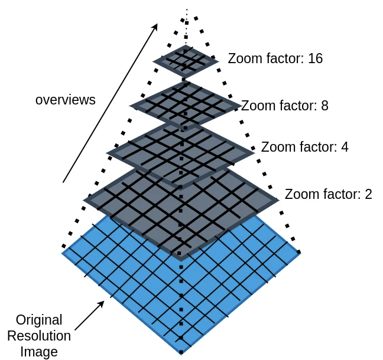
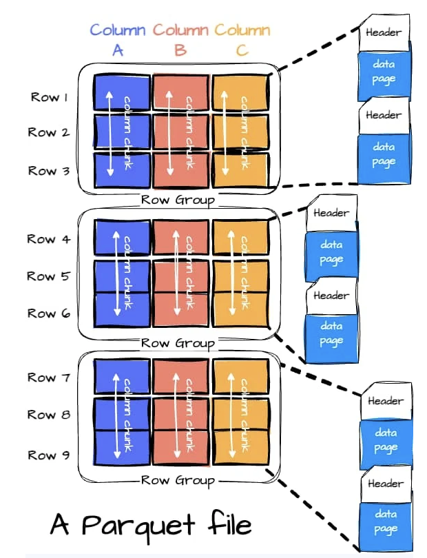
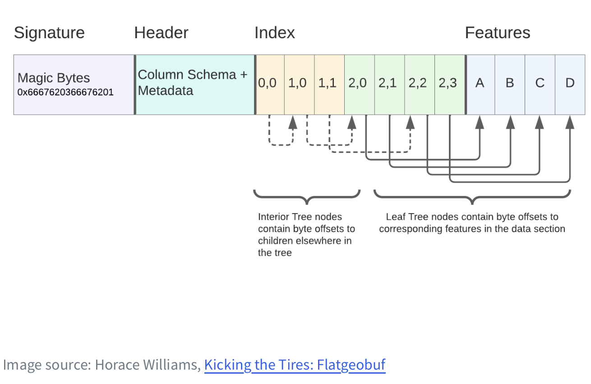

# Hva er egentlig Cloud Native Geospatial?

### Introduksjon og Motivasjon

"Cloud-Native Geospatial" (CNG) er et paradigmeskifte i hvordan vi håndterer og aksesserer geospatiale data. Glem den tradisjonelle arbeidsflyten med å finne en ZIP-fil på en FTP-server, laste ned 3 GB med GML-filer, pakke ut, og så endelig laste det inn i GIS-programvaren – bare for å oppdage at du ser på feil område. Motivasjonen bak CNG er å fjerne denne unødvendige dataoverføringen og ventetiden.

### Problem og Løsning: "Partial" og "Parallel Reads"

Det tradisjonelle problemet er at filformater som en standard GeoTIFF eller Shapefil er designet for å bli lest fra en rask, lokal harddisk. De er ikke "stream-bare". Hvis du trenger pikslene i nedre høyre hjørne av en 10 GB GeoTIFF, må du kanskje lese gjennom nesten hele filen for å finne dem.

"Cloud-native"-løsningen er å internt strukturere filene slik at de kan leses effektivt over HTTP. "Magien" ligger i å utnytte **HTTP Range Requests**. Tenk på det som å streame en 80GB 4K-film: du trenger ikke laste ned hele filen for å hoppe til de siste fem minuttene. En CNG-fil (som en **Cloud Optimized GeoTIFF, COG**) har en intern indeks i starten. En klient (som QGIS) leser denne lille indeksen først, og ber deretter serveren om _kun_ de spesifikke bytene den trenger for å vise kartutsnittet ditt. Dette muliggjør:

- **Partial Reads:** Hente bare en del av filen (f.eks. ett zoom-nivå, ett tidssteg).
- **Parallel Reads:** Flere prosesser som henter forskjellige deler av samme fil samtidig, noe som er kritisk for høy ytelse

### Forholdet til andre standarder

CNG-formater erstatter ikke nødvendigvis tradisjonelle OGC-tjenester (som WMS/WFS), men de tilbyr et kraftig, "server-løst" alternativ. I stedet for å vedlikeholde en aktiv server-applikasjon (som MapServer/GeoServer) som dynamisk genererer bilder eller features, kan du legge en statisk COG- eller FlatGeobuf-fil i en "dum" skylagringsbøtte (som S3 eller Azure Blob). Klienten (QGIS, MapLibre, OpenLayers) gjør jobben. Dette er ofte dramatisk billigere, mer skalerbart og enklere å vedlikeholde. Web-standarder som GeoJSON og Vector Tiles er nært beslektet; PMTiles er for eksempel en måte å samle `vector tiles` i én enkelt, cloud native fil.

### Hva med Metadata? => STAC

Et siste, kritisk poeng: Hvis alle dataene dine bare er statiske filer, hvordan kan brukere finne dem? Svaret er **STAC (SpatioTemporal Asset Catalog)**. STAC er en enkel, standardisert JSON-spesifikasjon som fungerer som "limet" i dette økosystemet. Det er en metadata-standard som beskriver hva dataene er, hvor de dekker, når de er fra, og viktigst av alt: lenker direkte til de sky-native filene (f.eks. COG, GeoParquet, Zarr) som utgjør ressursen.

## Formater

### Oversikt over aktuelle formater

| Format                                 | Datatype                          | Primær bruk                                                   | Fordeler / Ulemper                                                                                                                                                                                                                                                                                                                                                   | Eksempel                                                                                                                                                      | “Server-alternativet”                  |
| :------------------------------------- | :-------------------------------- | :------------------------------------------------------------ | :------------------------------------------------------------------------------------------------------------------------------------------------------------------------------------------------------------------------------------------------------------------------------------------------------------------------------------------------------------------- | :------------------------------------------------------------------------------------------------------------------------------------------------------------ | :------------------------------------- |
| **Cloud Optimized GeoTIFF (COG)**      | Raster (2D)                       | Effektiv streaming av 2D-bilder (ortofoto, DEM)               | **\+** Utnytter HTTP Range Requests **\+** Bred støtte (Web, GDAL, QGIS, ArcGIS) **\+** Bakoverkompatibel (er en gyldig GeoTIFF) **\-** Ineffektiv for \>3 dimensjoner (fks tidsserier)                                                                                                                                                                     | Streaming av flyfoto eller høydedata (DEM) direkte inn i webklienter eller GIS-klienter (QGIS/ArcGIS Pro) uten full nedlasting eller WMS-servere              | OGC WMS OGC WCS                     |
| **GeoParquet**                         | Vektor (Punkt, linjer, polygoner) | Storskala _analyse_ av vektordata                             | **\+** Columnar format (raske analytiske spørringer, aggregates) **\+** Høy kompresjon **\+** Standard i data science-økosystemet (Spark, DuckDB, Pandas) **\-** Ikke optimalisert for rask visualisering (FGB er ofte raskere) **\-** V1.0 mangler native spatial index (Bruker bbox på row groups) **\-** Ikke designet for transaksjonelle updates | Laste ned alle polygoner med “artype=myr” fra AR50 i Agder. Uten å laste ned hele datasettet eller en database/API-server                                     | OGC API Features OGC WPS OGC WFS |
| **FlatGeobuf (FGB)**                   | Vektor (Punkt, linjer, polygoner) | Rask _streaming_ og visualisering av vektordata (web/desktop) | **\+** Ekstremt rask read-ytelse **\+** Innebygd spatial index (R-tree) **\+** Kan streame data _progressivt_ (vise features før hele filen er lastet) **\-** Ikke et analytisk format (GeoParquet er bedre) **\-** Støtter ikke transaksjoner eller updates **\-** En geometritype per fil (fks point, line, polygon)                                | Hente ut geografiske data for et kartutsnitt på web uten behov for en dedikert feature server.                                                                | OGC API Features OGC WFS            |
| **PMTiles**                            | Vector Tiles / Raster Tiles       | "Server-løs" distribusjon av vector tiles for web-kart        | **\+** Enkeltfil-format **\+** Krever ingen server-applikasjon (kan hostes på statisk object storage som S3/Blob) **\+** Billig og skalerbart **\-** Read-only; data må forhåndsprosesseres **\-** Ikke et analyseformat. Data er optimalisert for visualisering i MVT/PBF. **\-** Begrenset til Mercator-projeksjon for de fleste web-biblioteker.   | Publisere Kartverkets "Norgeskart" (f.eks. Topo-data) som et interaktivt bakgrunnskart for en web-app, hostet direkte fra object storage uten en tile-server. | OGC API Tiles OGC WMTS              |
| **Cloud Optimized Point Cloud (COPC)** | Punktsky (LiDAR)                  | Streaming og analyse av massive punktsky-datasett             | **\+** Basert på LAZ (god kompresjon) **\+** Octree-struktur gir effektiv romlig indeksering og LOD (Level of Detail) **\+** Enkeltfil-format **\-** Nyere format, støtte er under utvikling (men god i PDAL)                                                                                                                                               | Visualisering og analyse av Kartverkets nasjonale detaljerte høydedata (LiDAR-punktsky) i en web-viewer eller QGIS uten å laste ned terabytes med LAZ-filer.  | OGC I3S OGC API 3D GeoVolumes       |
| **Zarr**                               | N-dimensjonal Array (Data Cube)   | Håndtering av multidimensjonale vitenskapelige data           | **\+** Håndterer N-dimensjoner (x, y, tid, dybde) **\+** Chunked lagring, perfekt for parallellprosessering (Dask, xarray) **\+** Fleksible codecs (kompresjon) **\-** Mer komplekst. Støtte i tradisjonelt GIS er mindre modent enn COG.                                                                                                                   | Lagring og analyse av tidsserier med meteorologiske data                                                                                                      | OGC WCS OGC API Coverage            |

## Dypdykk i formater

### Cloud Optimized GeoTIFF (COG)

### GeoParquet

### FlatGeobuf (FGB)

### PMTiles

## Referanser

https://guide.cloudnativegeo.org  
https://forrest.nyc/cloud-native-geospatial-formats-geoparquet-zarr-cog-and-pmtiles-explained/
