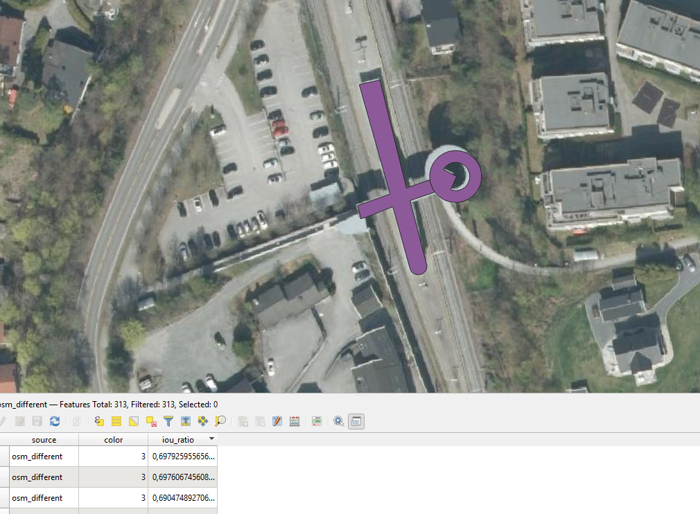

# GIS-søk

Dette prosjektet adresserer [GitHub Issue #36](https://github.com/kartAI/skygeo/issues/36) og har som mål å:

- Finne en rask måte å søke i store Parquet-datasett som ligger i skyen
- Lage et sammenslått byggdatasett som kombinerer bygninger fra både FKB åpen og OSM
- Gi best mulig utgangspunkt for videre analyser (kvalitet, dekning, avvik, tidsserier m.m.)

## Kom i gang (raskt)

1) Krav:
   - VS Code eller Cursor (VS Code-fork)
   - Docker + "Dev Containers"-utvidelsen
2) Åpne i Dev Container:
   - Trykk F1 → "Dev Containers: Reopen in Container"
3) Azure-tilgang (offentlig, uten connection string):
   - Vi bruker DuckDB SECRET med kun kontonavn (offentlig lesetilgang), som i `sok-testing.ipynb`:
     ```sql
     CREATE SECRET secret (
         TYPE azure,
         PROVIDER config,
         ACCOUNT_NAME 'doppablobstorage'
     );
     SET azure_transport_option_type = curl;
     ```
   - Deretter kan du lese fra `az://...` direkte uten nøkler.
4) Start Jupyter:
   ```bash
   jupyter notebook --ip=0.0.0.0 --port=8888 --no-browser --allow-root
   ```
   Jupyter: `http://localhost:8888`
5) Åpne og kjør `gis-sok/sok-testing.ipynb`.

Diskplass: Rutinen oppretter flere lokale DB- og Parquet-filer. Ha 4–5 GB ledig. Eksempler:
- `gis-sok/buildings.db`
- `gis-sok/buildings.parquet`
- `gis-sok/osm.parquet`
- `gis-sok/fkb.parquet`
- `.pmtiles` og midlertidige filer

## Overordnet beskrivelse

Vi bruker DuckDB til å lese/spørre mot store Parquet-datasett i skyen (via tilkoblingsstreng), og bygger et sammenslått byggdatasett som forener bygninger fra FKB åpen og OSM. Målet er høy dekningsgrad og kvalitet, med robust deduplisering og sammenslåing av "samme" bygg selv ved små geometriavvik, slik at videre analyser kan gjøres effektivt.

## Løsningsmetode

- Effektive skyspørringer: DuckDB mot Parquet i objektlagring
- Kandidatmatching av polygoner (bygninger) med små variasjoner
- Sammenslåing og deduplisering til ett samlet `buildings`-datasett
- Lokal persistens til Parquet/DB for rask interaktiv analyse og visualisering

## Utviklingsmiljø

Prosjektet bruker Dev Containers for å gjøre det enkelt å komme i gang og få alle verktøy på plass uten lokal installasjon (Windows, macOS og Linux). VS Code eller Cursor anbefales, men andre IDE-er kan fungere.

Containeren er basert på `duckdb/duckdb` og inkluderer:
- **Python 3** – scripting og databehandling
- **Jupyter Notebook/Lab** – interaktiv utvikling og analyse
- **DuckDB (Python)** – spørring og prosessering av store datasett
- **GeoPandas** – GIS-databehandling
- **PyArrow** – Parquet/kolonneformater
- **Kepler.gl** – visualisering av geodata

## Problemstilling

Når man jobber med GIS-data fra ulike kilder, er det ofte behov for å identifisere polygoner som representerer samme geografiske objekt, selv om de kan ha små variasjoner i:
- Koordinater
- Oppløsning/detaljnivå
- Grensedragning

Dette prosjektet utforsker metoder for å gjøre dette effektivt når datasettene er store, og å produsere et sammenslått byggdatasett som grunnlag for videre analyser.

## OSM vs FKB: forskjeller og eksempel

Denne seksjonen viser kort hvordan OSM og FKB kan avvike, og hvorfor en sammenslått tilnærming gir et mer komplett resultat.

### Visuelle sammenligninger

- OSM (eksempel):
  
  

- FKB (eksempel):
  
  

- Differanse (områder der datasettene er ulike):
  
  

- Animasjon (stegvis visning av forskjeller):
  
  

### Kristiansand-eksempelet (manglende bygg i FKB)

I et område i Kristiansand manglet FKB noen bygg. Trolig skjedde eksporten av FKB på et tidspunkt før disse byggene var registrert der. OSM hadde dem registrert, så ved å kombinere datasettene fikk vi et mer komplett byggdatasett til slutt.

### Kjent avvik og videre arbeid

- Eksempel: Ett bygg er delt i to polygoner i OSM, men ligger som én sammenhengende flate i FKB. Dette blir markert som “avvikende”.
- Slike tilfeller bør håndteres i videre arbeid (f.eks. med en pull request) ved å:
  - slå sammen nærliggende/tilstøtende OSM‑polygoner som åpenbart beskriver samme bygg,
  - bruke regler for delt geometri (delt kant/overlapp) og rimelige terskler,
  - kvalitetssikre mot metadata (bygg‑ID, navn, type) der det finnes.