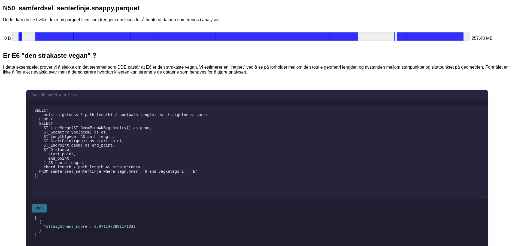
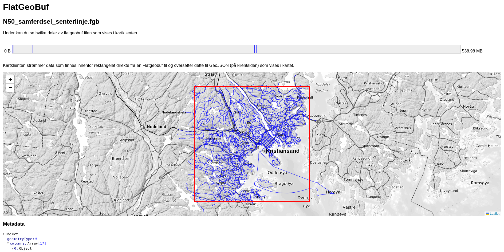

# Webapp som demonstrerer forskjellige CloudNative filformater.

## Parquet

Appen viser hvordan man ved bruk av DuckDB kan strømme data direkte fra en
parquet fil til nettleseren og analysere data.

## Flatgeobuf

Appen viser hvordan man kan strømme vektor data rett i kartet innenfor en
gitt bounding box. Ved å klikke på enkelte veilenker kan man og se egenskaper
knyttet til denne.
