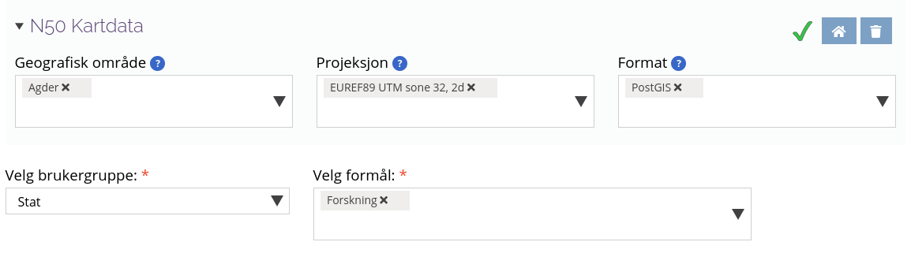

# PM Tiles

## Vector data

Formålet her er å konvertere N50 vektor data til PMTiles vektor data. Fordi N50 kommer på gdb format
er ikke dette helt trivielt. Måten det løses på her er en rekke konverteringer:

gdb => geojson => mbtiles => pmtiles

Dette er ikke nødvendigvis så Python vennlig og jeg bruker derfor heller docker og kommandolinje verktøy. Disse er:

- ogr2ogr: Konverterer gdb til geojson
- tippecanoe: Konverterer geojson til mbtiles
- pmtiles: Konverterer mbtiles til pmtiles


Det er mulig å kombinere flere lag i samme .pmtiles fil, men ved bruk av `vector/build.sh` scriptet fungerte
ikke dette helt som forventet. Lagene blir opprettet, men ved lavere zoom ser ikke kartet pent ut. Videreutvikling
oppfordres.

### Demo

Start med å laste ned N50 Kartdata fra GeoNorge:


Pakk ut innholdet i nedlastingen og plasser det under `pmtiles/vector/data/`

For å starte opp vektor demoen kan følgende kommandoer kjøres:

```bash
# Oppretter pmtiles for veier og bygninger 
cd vector
./build_layer.sh Basisdata_42_Agder_25832_N50Kartdata_FGDB.gdb N50_Samferdsel_senterlinje
./build_layer.sh Basisdata_42_Agder_25832_N50Kartdata_FGDB.gdb N50_BygningerOgAnlegg_omrade

# Starter tjenestene
cd ..
docker-compose up --build
```

Etter dette kan karttjenesten åpnes fra `localhost:3000/`
